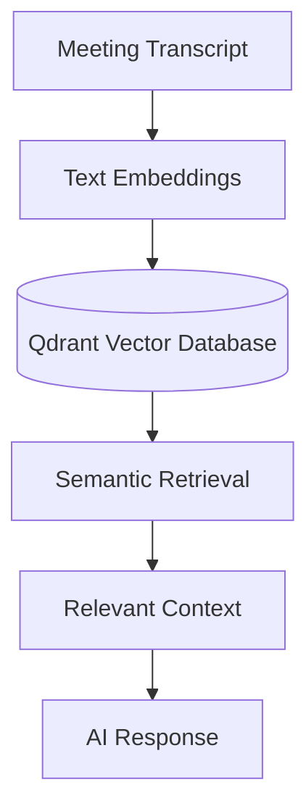
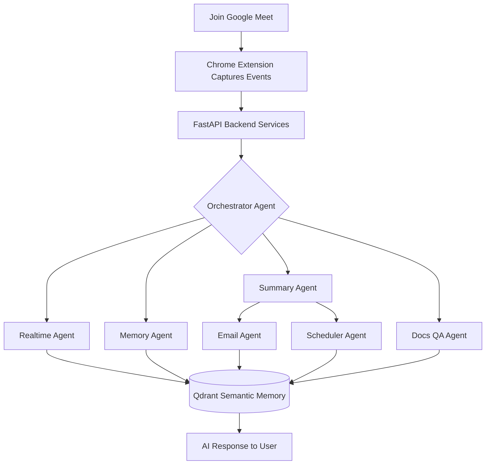

  
  <h3>A Production-Inspired Multi-Agent AI Meeting Copilot</h3>
  

    Transforming online meetings into intelligent, collaborative experiences through modular AI agents, semantic memory, and real-time assistance.
  

  

    <b>Powered by Google ADK, Lyzr, Agent-to-Agent (A2A) Communication & Qdrant.</b>
  

  

    
    
    
    
    
    
    
    
    
    
    
    
    
    
  

 

##  Project Vision

Modern meetings generate valuable discussions, decisions, and action items — but much of that information is quickly forgotten or scattered across notes, emails, and calendars.

**MeetMaxxing** reimagines meeting intelligence through a **multi-agent architecture**, where specialized AI agents collaborate instead of relying on a single monolithic AI workflow.

Built around **Google ADK**, **Lyzr**, **Agent-to-Agent (A2A) communication**, and **Qdrant semantic memory**, MeetMaxxing demonstrates how modern AI systems can coordinate, remember context, automate follow-ups, and assist users throughout an online meeting.

### Key Objectives

| Objective | Description |
| :--- | :--- |
| Multi-Agent Intelligence | Specialized AI agents collaborate to perform dedicated tasks instead of relying on a single monolithic LLM. |
| Real-Time Assistance | Contextual suggestions, meeting insights, and intelligent support while the meeting is in progress. |
| Persistent Semantic Memory | Store and retrieve meeting knowledge using vector embeddings powered by Qdrant. |

---

## Application Showcase

> **Design Language:** MeetMaxxing follows **Material 3 (M3)** from end to end, matching **Google Meet's native design language**—same elevation, motion, spacing, and color system—so it feels like a built-in feature rather than a browser extension. Designed for professionals, educators, students, founders, and teams who never want to miss important context.

---

# 🧩 Chrome Extension

The Chrome Extension acts as the primary AI workspace inside Google Meet, providing contextual assistance without interrupting the meeting.

### Extension Overview

<table style="border:none; border-collapse:collapse;">
<tr>
<td align="center" width="50%" style="border:none; padding:8px;">

**Chrome Extension**

Extension installed and available directly from Chrome.
</td>
<td align="center" width="50%" style="border:none; padding:8px; vertical-align:top;">

**Running Inside Google Meet**

Material 3 sidebar integrated directly into Google Meet.
</td>
</tr>
</table>

---

## AI Features

<table style="border:none; border-collapse:collapse;">
<tr>
<td width="25%" style="border:none; padding:6px; vertical-align:top;">

**Live AI Insights (Copilot)**

Real-time contextual suggestions, explanations, and meeting intelligence.
</td>
<td width="25%" style="border:none; padding:6px; vertical-align:top;">

**RAG ChatBot**

Ask questions using your uploaded documents and meeting knowledge.
</td>
<td width="25%" style="border:none; padding:6px; vertical-align:top;">

**Recap Agent**

Instant summaries for participants joining meetings late.
</td>
<td width="25%" style="border:none; padding:6px; vertical-align:top;">

**Live Transcript**

Rolling transcript generated live during the meeting.
</td>
</tr>
</table>

The extension combines a Material 3 interface with multiple AI agents—Copilot, RAG ChatBot, Recap Agent, and Live Transcript—allowing users to interact with meeting knowledge without leaving Google Meet.

---

# 🖥️ Frontend Dashboard

The web dashboard provides centralized access to meetings, semantic memory, uploaded knowledge, analytics, and AI-generated outputs.

<table style="border:none; border-collapse:collapse;">
<tr>
<td style="border:none; padding:8px;">

**Dashboard Overview**
</td>
</tr>
</table>

---

## Meeting Management

<table style="border:none; border-collapse:collapse; table-layout:fixed; width:100%;">
<tr>
<td width="50%" style="border:none; padding:8px; vertical-align:top;">

**Selecting Meetings**

Bulk selection for organizing and managing meetings.
</td>
<td width="50%" style="border:none; padding:8px; vertical-align:top;">

**Deleting Meetings**

Delete meetings individually or in batches.
</td>
</tr>
</table>

---

## Context Manager

Store PDFs, notes, documentation, and company knowledge that powers the RAG assistant.

<table style="border:none; border-collapse:collapse;">
<tr>
<td align="center" width="50%" style="border:none; padding:8px;">

**Context Manager**

Central repository for uploaded knowledge.
</td>
<td align="center" width="50%" style="border:none; padding:8px;">

**Uploading & Viewing**

Upload, organize, and manage contextual documents.
</td>
</tr>
</table>

---

## Semantic Search

<table style="border:none; border-collapse:collapse;">
<tr>
<td style="border:none; padding:8px;">

**Semantic Search**

Retrieve information using semantic similarity instead of keywords.
</td>
</tr>
</table>

---

## Meeting Summaries

<table style="border:none; border-collapse:collapse;">
<tr>
<td align="center" width="50%" style="border:none; padding:8px;">

**Summary View**

AI-generated meeting overview with highlights.
</td>
<td align="center" width="50%" style="border:none; padding:8px;">

**Detailed Summary**

Actionable discussion points and key decisions.
</td>
</tr>
</table>

---

## Productivity Agents

<table style="border:none; border-collapse:collapse;">
<tr>
<td align="center" width="50%" style="border:none; padding:8px;">
 

**Mail Agent**

Generate professional follow-up emails from meeting discussions.
</td>
<td align="center" width="50%" style="border:none; padding:8px;">

**Calendar Agent**

Convert action items into reminders and calendar events.
</td>
</tr>
<tr>
<td align="center" width="50%" style="border:none; padding:8px;">

**Action Items**

Track tasks assigned during meetings.
</td>
<td align="center" width="50%" style="border:none; padding:8px;">

**Meeting Transcripts**

Fully searchable transcript archive for every meeting.
</td>
</tr>
</table>

Together, the dashboard extends MeetMaxxing beyond live meetings by organizing meeting history, searchable knowledge, AI-generated summaries, transcripts, emails, calendar events, and semantic memory into a single Material 3 workspace.

---

##  Why MeetMaxxing?

Unlike conventional AI meeting assistants that rely on a single large language model prompt, MeetMaxxing adopts a **collaborative multi-agent design**.

Each AI agent focuses on a specialized responsibility — from live assistance and meeting summarization to semantic memory retrieval, email drafting, scheduling, and document-based question answering.

| Built With | Purpose |
| :--- | :--- |
| Google ADK | Specialized AI agents |
| A2A Communication | Seamless agent collaboration |
| Qdrant | Persistent semantic memory |
| Lyzr | Intelligent workflow orchestration |

---

##  Core Features

| Feature | Description |
| :--- | :--- |
| 🤖 Multi-Agent Intelligence | Specialized AI agents collaborate to perform dedicated tasks instead of relying on a single monolithic LLM. |
| ⚡ Real-Time Assistance | Contextual suggestions, meeting insights, and intelligent support while the meeting is still in progress. |
| 🧠 Semantic Memory | Store and retrieve meeting knowledge using vector embeddings powered by Qdrant. |
| 📝 Smart Meeting Summaries | Automatically generate concise summaries, key discussion points, and actionable takeaways. |
| ✉️ AI Follow-ups | Generate professional follow-up emails containing meeting highlights and action items. |
| 📅 Intelligent Scheduling | Create reminders and follow-up meetings directly from extracted action items. |
| 📄 Document Question Answering | Upload supporting documents and let AI agents answer questions using meeting context. |
| ⏱️ Late Join Recaps | Users joining late receive an instant AI-generated summary of everything discussed so far. |

---

##  AI Agent Ecosystem

MeetMaxxing follows a **collaborative multi-agent architecture** where each agent has a clearly defined responsibility. Instead of overloading a single model with every task, specialized agents work together to deliver a smarter and more scalable meeting experience.

| Agent | Responsibility |
| :--- | :--- |
| Transcription Agent 🎙️ | Processes meeting transcripts and streams conversation data to the system. |
| Realtime Agent ⚡ | Generates contextual suggestions and live assistance during meetings. |
| Summary Agent 📝 | Produces concise meeting summaries, key points, and action items. |
| Memory Agent 🧠 | Stores semantic embeddings inside Qdrant and retrieves historical meeting knowledge. |
| Email Agent ✉️ | Drafts follow-up emails using meeting context. |
| Scheduler Agent 📅 | Converts action items into calendar events and reminders. |
| Docs QA Agent 📄 | Answers user questions using uploaded documents combined with meeting context. |
| Late Join Agent ⏱️ | Instantly summarizes previous discussion for participants joining mid-meeting. |
| Orchestrator Agent 🎭 | Coordinates communication between agents and routes tasks intelligently. |

---

##  Google ADK in Action

Google ADK forms the backbone of MeetMaxxing's intelligent agent ecosystem.

Rather than building one large AI workflow, MeetMaxxing uses Google ADK to create **specialized agents**, each equipped with its own reasoning capabilities and dedicated tools.

| Benefit | Result |
| :--- | :--- |
| Independent task execution | Agents run without blocking each other |
| Tool-specific reasoning | Each agent reasons only about its own domain |
| Scalability | New agents added without touching existing ones |
| Maintainability | Isolated logic, easier debugging |
| Collaborative decision making | Agents combine outputs for richer answers |

---

##  Agent-to-Agent (A2A) Communication

One of the core objectives of MeetMaxxing is to demonstrate effective **Agent-to-Agent (A2A) communication**.

Instead of executing tasks sequentially within a single workflow, specialized agents exchange context and collaborate to solve complex meeting scenarios.

  

| Benefit | Description |
| :--- | :--- |
| 🔄 Parallel execution | Specialized tasks run concurrently |
| 🧱 Separation of responsibilities | Each agent owns one job |
| 🔌 Extensibility | New agents plug in easily |
| 📡 Efficient sharing | Context flows directly between agents |
| 🏭 Production-inspired orchestration | Mirrors real-world multi-agent systems |

---

##  Persistent Memory with Qdrant

MeetMaxxing doesn't forget previous meetings. Meeting conversations are transformed into **vector embeddings** and stored inside **Qdrant**, enabling semantic search across historical discussions.

This enables users to ask contextual questions like:
> *"What decisions were made regarding our authentication module last week?"*

Instead of keyword matching, Qdrant retrieves semantically similar discussions, allowing AI agents to respond with meaningful context.

---

##  Why This Architecture?

Traditional AI meeting assistants often rely on a **single prompt** to perform transcription, summarization, memory retrieval, scheduling, and follow-up generation.

MeetMaxxing takes a different approach. Responsibilities are distributed across specialized agents that collaborate through A2A communication.

| Advantage | Why It Matters |
| :--- | :--- |
| ✅ Modular and maintainable | Each agent is isolated and testable |
| ✅ Easy to extend | New agents plug into the orchestrator |
| ✅ Better scalability | Load spreads across agents |
| ✅ Clear separation of responsibilities | No monolithic prompt sprawl |
| ✅ Persistent semantic memory | Context survives across meetings |
| ✅ Production-inspired design | Mirrors real multi-agent systems |

---

##  End-to-End Workflow

Every interaction inside MeetMaxxing follows an intelligent event-driven workflow.

---

##  Technology Stack

| Layer | Technology | Purpose |
| :--- | :--- | :--- |
| AI Framework 🤖 | Google ADK, Lyzr | Core agent logic and orchestration |
| Communication 📡 |   | Inter-agent messaging and RPC |
| Memory 🧠 |  | Vector embeddings and semantic search |
| Backend ⚙️ |   | High-performance API services |
| Frontend 🖥️ |     | Dashboard and user inter