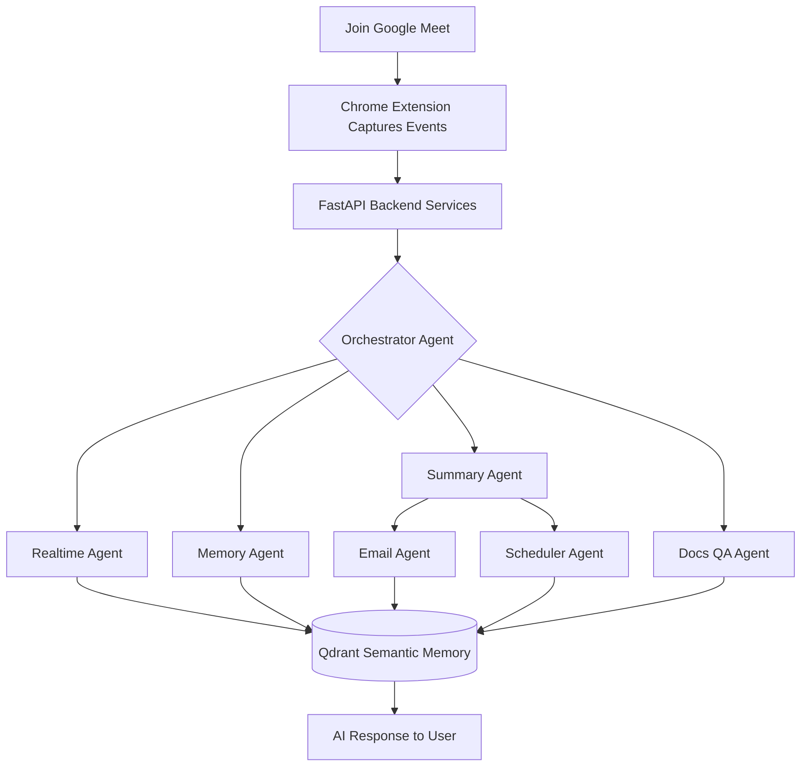
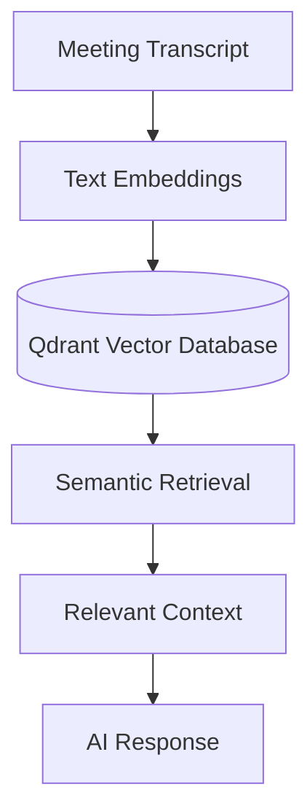

  
  <h3>A Production-Inspired Multi-Agent AI Meeting Copilot</h3>
  
Transforming online meetings into intelligent, collaborative experiences through modular AI agents, semantic memory, and real-time assistance.

  
<b>Powered by Google ADK, Lyzr, Agent-to-Agent (A2A) Communication & Qdrant.</b>

  

    
    
    
    
    
    
    
    
    
    
    
    
    
    
  

---

## Vision

Modern meetings generate valuable discussions, decisions, and action items — but much of that information is quickly forgotten or scattered across notes, emails, and calendars.

**MeetMaxxing** reimagines meeting intelligence through a **multi-agent architecture**: specialized AI agents collaborate instead of relying on one monolithic AI workflow. Built around **Google ADK**, **Lyzr**, **Agent-to-Agent (A2A) communication**, and **Qdrant semantic memory**, it coordinates context, automates follow-ups, and assists users live during meetings.

> **Design Language:** Follows **Material 3 (M3)** end to end, matching Google Meet's native elevation, motion, spacing, and color system — feels built-in rather than bolted-on. Built for professionals, educators, students, founders, and teams who never want to miss important context.

---

## Core Features

| Feature | Description |
| :--- | :--- |
| 🤖 Multi-Agent Intelligence | Specialized agents each own one task instead of one monolithic LLM. |
| ⚡ Live Copilot | Real-time contextual suggestions and insights while the meeting is in progress. |
| 🧠 Semantic Memory | Meeting knowledge stored/retrieved as vector embeddings via Qdrant. |
| 📝 Smart Summaries | Auto-generated summaries, key points, and action items. |
| ✉️ AI Follow-ups | Professional follow-up emails drafted from meeting content. |
| 📅 Intelligent Scheduling | Action items converted into reminders and calendar events. |
| 📄 Docs Q&A (RAG) | Upload documents; ask questions using meeting + doc context. |
| ⏱️ Late-Join Recaps | Instant AI summary of everything missed so far. |
| 🔍 Semantic Search | Retrieve past discussions by meaning, not keywords. |

---

## AI Agent Ecosystem

Each agent has one clear responsibility, coordinated by an orchestrator instead of a single overloaded model.

| Agent | Responsibility |
| :--- | :--- |
| 🎭 Orchestrator | Routes tasks and coordinates inter-agent communication. |
| 🎙️ Transcription | Processes and streams live meeting transcript. |
| ⚡ Realtime (Copilot) | Live contextual suggestions during the meeting. |
| 📝 Summary | Concise summaries, key points, action items. |
| 🧠 Memory | Stores/retrieves semantic embeddings in Qdrant. |
| ✉️ Email | Drafts follow-up emails from meeting context. |
| 📅 Scheduler | Converts action items into calendar events/reminders. |
| 📄 Docs QA | Answers questions using uploaded docs + meeting context. |
| ⏱️ Late Join | Summarizes prior discussion for late joiners. |

**Why multi-agent?**

| Advantage | Why it matters |
| :--- | :--- |
| Modular & maintainable | Each agent isolated and testable |
| Easy to extend | New agents plug into the orchestrator |
| Scalable | Load spreads across agents, run concurrently |
| No monolithic prompt sprawl | Clear separation of responsibilities |
| Persistent semantic memory | Context survives across meetings |

---

## Architecture

**Google ADK** powers each specialized agent's own reasoning + tools. **A2A communication** lets agents exchange context and collaborate in parallel rather than executing sequentially. **Qdrant** stores meeting transcripts as vector embeddings for semantic recall — e.g. asking *"What decisions were made on auth module last week?"* retrieves semantically similar discussions instead of keyword matches.

  

### End-to-End Workflow

### Memory Pipeline

---

## Technology Stack

| Layer | Technology | Purpose |
| :--- | :--- | :--- |
| AI Framework | Google ADK, Lyzr | Agent logic + orchestration |
| Communication | A2A, gRPC | Inter-agent messaging & RPC |
| Memory | Qdrant | Vector embeddings, semantic search |
| Backend | FastAPI, Python | High-performance API services |
| Frontend | Next.js, React, TypeScript, Tailwind CSS | Dashboard & UI |
| Cache/Queue | Redis | Fast in-memory state |
| Database | Supabase | Persistent structured storage |
| Client | Chrome Extension | In-meeting AI workspace |

---

## Application Showcase

### Chrome Extension (Live in Google Meet)

| | |
| :---: | :---: |
|  **Extension in Chrome** |  **M3 Sidebar Inside Meet** |

**In-meeting AI panels:**

| | | | |
| :---: | :---: | :---: | :---: |
|  **Copilot** |  **RAG ChatBot** |  **Recap Agent** |  **Live Transcript** |

### Web Dashboard

 <b>Dashboard Overview</b>

**Meeting management:**

| | |
| :---: | :---: |
|  **Bulk Selection** |  **Bulk Delete** |

**Context manager (RAG knowledge base):**

| | |
| :---: | :---: |
|  **Repository** |  **Upload & Organize** |

**Semantic search:**

**Meeting summaries:**

| | |
| :---: | :---: |
|  **Overview** |  **Detailed View** |

**Productivity agents:**

| | |
| :---: | :---: |
|  **Mail Agent** |  **Calendar Agent** |
|  **Action Items** |  **Transcript Archive** |

</document_content>
