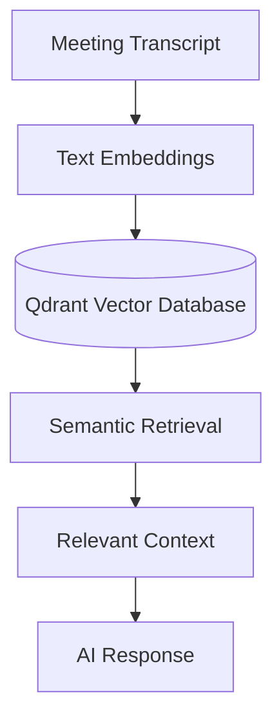
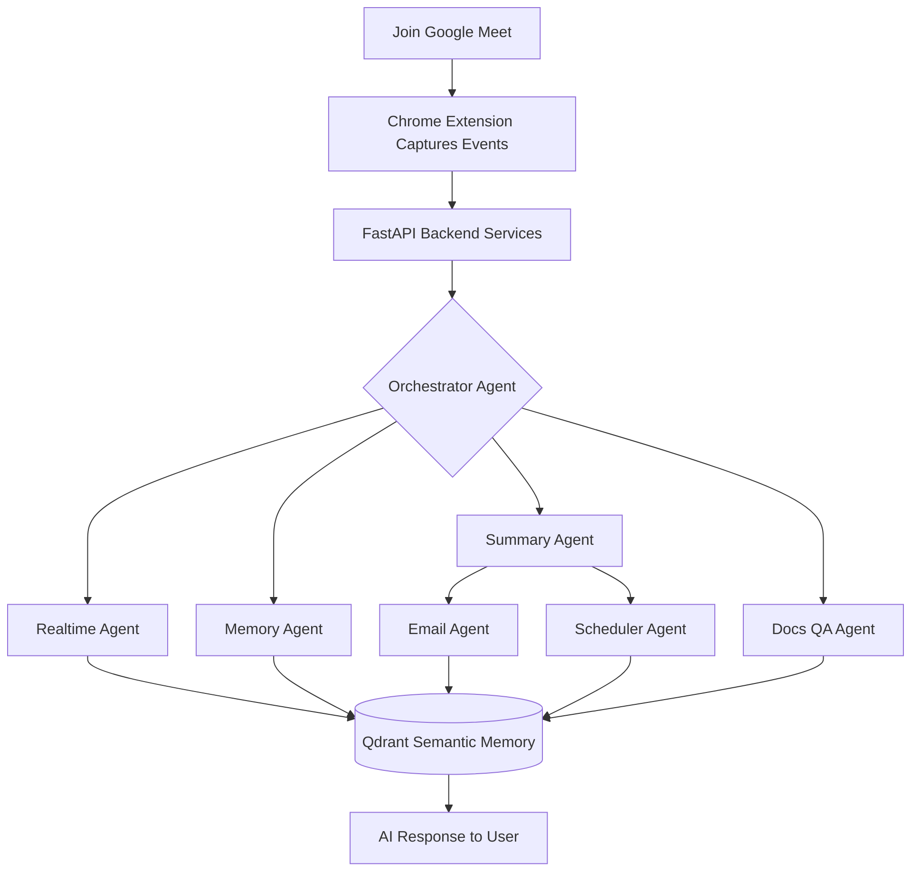

<div align="center">
  
  <h3>A Production-Inspired Multi-Agent AI Meeting Copilot</h3>
  <p>
    Transforming online meetings into intelligent, collaborative experiences through modular AI agents, semantic memory, and real-time assistance.
  </p>
  <p>
    <b>Powered by Google ADK, Lyzr, Agent-to-Agent (A2A) Communication & Qdrant.</b>
  </p>

  <div>
    
    
    
    
    
    
    
    
    
    
    
    
    
    
  </div>
</div>

<br />

##  Project Vision

Modern meetings generate valuable discussions, decisions, and action items — but much of that information is quickly forgotten or scattered across notes, emails, and calendars.

**MeetMaxxing** reimagines meeting intelligence through a **multi-agent architecture**, where specialized AI agents collaborate instead of relying on a single monolithic AI workflow.

Built around **Google ADK**, **Lyzr**, **Agent-to-Agent (A2A) communication**, and **Qdrant semantic memory**, MeetMaxxing demonstrates how modern AI systems can coordinate, remember context, automate follow-ups, and assist users throughout an online meeting.

### Key Objectives

| Objective | Description |
| :--- | :--- |
| Multi-Agent Intelligence | Specialized AI agents collaborate to perform dedicated tasks instead of relying on a single monolithic LLM. |
| Real-Time Assistance | Contextual suggestions, meeting insights, and intelligent support while the meeting is in progress. |
| Persistent Semantic Memory | Store and retrieve meeting knowledge using vector embeddings powered by Qdrant. |

---

##  Why MeetMaxxing?

Unlike conventional AI meeting assistants that rely on a single large language model prompt, MeetMaxxing adopts a **collaborative multi-agent design**.

Each AI agent focuses on a specialized responsibility — from live assistance and meeting summarization to semantic memory retrieval, email drafting, scheduling, and document-based question answering.

| Built With | Purpose |
| :--- | :--- |
| Google ADK | Specialized AI agents |
| A2A Communication | Seamless agent collaboration |
| Qdrant | Persistent semantic memory |
| Lyzr | Intelligent workflow orchestration |

---

##  Core Features

| Feature | Description |
| :--- | :--- |
| 🤖 Multi-Agent Intelligence | Specialized AI agents collaborate to perform dedicated tasks instead of relying on a single monolithic LLM. |
| ⚡ Real-Time Assistance | Contextual suggestions, meeting insights, and intelligent support while the meeting is still in progress. |
| 🧠 Semantic Memory | Store and retrieve meeting knowledge using vector embeddings powered by Qdrant. |
| 📝 Smart Meeting Summaries | Automatically generate concise summaries, key discussion points, and actionable takeaways. |
| ✉️ AI Follow-ups | Generate professional follow-up emails containing meeting highlights and action items. |
| 📅 Intelligent Scheduling | Create reminders and follow-up meetings directly from extracted action items. |
| 📄 Document Question Answering | Upload supporting documents and let AI agents answer questions using meeting context. |
| ⏱️ Late Join Recaps | Users joining late receive an instant AI-generated summary of everything discussed so far. |

---

##  AI Agent Ecosystem

MeetMaxxing follows a **collaborative multi-agent architecture** where each agent has a clearly defined responsibility. Instead of overloading a single model with every task, specialized agents work together to deliver a smarter and more scalable meeting experience.

| Agent | Responsibility |
| :--- | :--- |
| Transcription Agent 🎙️ | Processes meeting transcripts and streams conversation data to the system. |
| Realtime Agent ⚡ | Generates contextual suggestions and live assistance during meetings. |
| Summary Agent 📝 | Produces concise meeting summaries, key points, and action items. |
| Memory Agent 🧠 | Stores semantic embeddings inside Qdrant and retrieves historical meeting knowledge. |
| Email Agent ✉️ | Drafts follow-up emails using meeting context. |
| Scheduler Agent 📅 | Converts action items into calendar events and reminders. |
| Docs QA Agent 📄 | Answers user questions using uploaded documents combined with meeting context. |
| Late Join Agent ⏱️ | Instantly summarizes previous discussion for participants joining mid-meeting. |
| Orchestrator Agent 🎭 | Coordinates communication between agents and routes tasks intelligently. |

---

##  Google ADK in Action

Google ADK forms the backbone of MeetMaxxing's intelligent agent ecosystem.

Rather than building one large AI workflow, MeetMaxxing uses Google ADK to create **specialized agents**, each equipped with its own reasoning capabilities and dedicated tools.

| Benefit | Result |
| :--- | :--- |
| Independent task execution | Agents run without blocking each other |
| Tool-specific reasoning | Each agent reasons only about its own domain |
| Scalability | New agents added without touching existing ones |
| Maintainability | Isolated logic, easier debugging |
| Collaborative decision making | Agents combine outputs for richer answers |

---

##  Agent-to-Agent (A2A) Communication

One of the core objectives of MeetMaxxing is to demonstrate effective **Agent-to-Agent (A2A) communication**.

Instead of executing tasks sequentially within a single workflow, specialized agents exchange context and collaborate to solve complex meeting scenarios.

<p align="center">
  
</p>

| Benefit | Description |
| :--- | :--- |
| 🔄 Parallel execution | Specialized tasks run concurrently |
| 🧱 Separation of responsibilities | Each agent owns one job |
| 🔌 Extensibility | New agents plug in easily |
| 📡 Efficient sharing | Context flows directly between agents |
| 🏭 Production-inspired orchestration | Mirrors real-world multi-agent systems |

---

##  Persistent Memory with Qdrant

MeetMaxxing doesn't forget previous meetings. Meeting conversations are transformed into **vector embeddings** and stored inside **Qdrant**, enabling semantic search across historical discussions.

<div align="center">



</div>

This enables users to ask contextual questions like:
> *"What decisions were made regarding our authentication module last week?"*

Instead of keyword matching, Qdrant retrieves semantically similar discussions, allowing AI agents to respond with meaningful context.

---

## Application Showcase

> **Design Language:** MeetMaxxing follows **Material 3 (M3)** from end to end, matching **Google Meet's native design language**—same elevation, motion, spacing, and color system—so it feels like a built-in feature rather than a browser extension. Designed for professionals, educators, students, founders, and teams who never want to miss important context.

---

# 🧩 Chrome Extension

The Chrome Extension acts as the primary AI workspace inside Google Meet, providing contextual assistance without interrupting the meeting.

### Extension Overview

<table style="border:none; border-collapse:collapse;">
<tr>
<td align="center" width="50%" style="border:none; padding:8px;">


**Chrome Extension**

Extension installed and available directly from Chrome.
</td>
<td align="center" width="50%" style="border:none; padding:8px; vertical-align:top;">


**Running Inside Google Meet**

Material 3 sidebar integrated directly into Google Meet.
</td>
</tr>
</table>

---

## AI Features

<table style="border:none; border-collapse:collapse;">
<tr>
<td width="25%" style="border:none; padding:6px; vertical-align:top;">


**Live AI Insights (Copilot)**

Real-time contextual suggestions, explanations, and meeting intelligence.
</td>
<td width="25%" style="border:none; padding:6px; vertical-align:top;">


**RAG ChatBot**

Ask questions using your uploaded documents and meeting knowledge.
</td>
<td width="25%" style="border:none; padding:6px; vertical-align:top;">


**Recap Agent**

Instant summaries for participants joining meetings late.
</td>
<td width="25%" style="border:none; padding:6px; vertical-align:top;">


**Live Transcript**

Rolling transcript generated live during the meeting.
</td>
</tr>
</table>

The extension combines a Material 3 interface with multiple AI agents—Copilot, RAG ChatBot, Recap Agent, and Live Transcript—allowing users to interact with meeting knowledge without leaving Google Meet.

---

# 🖥️ Frontend Dashboard

The web dashboard provides centralized access to meetings, semantic memory, uploaded knowledge, analytics, and AI-generated outputs.

<table style="border:none; border-collapse:collapse;">
<tr>
<td style="border:none; padding:8px;">


**Dashboard Overview**
</td>
</tr>
</table>

---

## Meeting Management

<table style="border:none; border-collapse:collapse; table-layout:fixed; width:100%;">
<tr>
<td width="50%" style="border:none; padding:8px; vertical-align:top;">


**Selecting Meetings**

Bulk selection for organizing and managing meetings.
</td>
<td width="50%" style="border:none; padding:8px; vertical-align:top;">


**Deleting Meetings**

Delete meetings individually or in batches.
</td>
</tr>
</table>

---

## Context Manager

Store PDFs, notes, documentation, and company knowledge that powers the RAG assistant.

<table style="border:none; border-collapse:collapse;">
<tr>
<td align="center" width="50%" style="border:none; padding:8px;">


**Context Manager**

Central repository for uploaded knowledge.
</td>
<td align="center" width="50%" style="border:none; padding:8px;">


**Uploading & Viewing**

Upload, organize, and manage contextual documents.
</td>
</tr>
</table>

---

## Semantic Search

<table style="border:none; border-collapse:collapse;">
<tr>
<td style="border:none; padding:8px;">


**Semantic Search**

Retrieve information using semantic similarity instead of keywords.
</td>
</tr>
</table>

---

## Meeting Summaries

<table style="border:none; border-collapse:collapse;">
<tr>
<td align="center" width="50%" style="border:none; padding:8px;">


**Summary View**

AI-generated meeting overview with highlights.
</td>
<td align="center" width="50%" style="border:none; padding:8px;">


**Detailed Summary**

Actionable discussion points and key decisions.
</td>
</tr>
</table>

---

## Productivity Agents

<table style="border:none; border-collapse:collapse;">
<tr>
<td align="center" width="50%" style="border:none; padding:8px;">


**Mail Agent**

Generate professional follow-up emails from meeting discussions.
</td>
<td align="center" width="50%" style="border:none; padding:8px;">


**Calendar Agent**

Convert action items into reminders and calendar events.
</td>
</tr>
<tr>
<td align="center" width="50%" style="border:none; padding:8px;">


**Action Items**

Track tasks assigned during meetings.
</td>
<td align="center" width="50%" style="border:none; padding:8px;">


**Meeting Transcripts**

Fully searchable transcript archive for every meeting.
</td>
</tr>
</table>

Together, the dashboard extends MeetMaxxing beyond live meetings by organizing meeting history, searchable knowledge, AI-generated summaries, transcripts, emails, calendar events, and semantic memory into a single Material 3 workspace.

---

##  Why This Architecture?

Traditional AI meeting assistants often rely on a **single prompt** to perform transcription, summarization, memory retrieval, scheduling, and follow-up generation.

MeetMaxxing takes a different approach. Responsibilities are distributed across specialized agents that collaborate through A2A communication.

| Advantage | Why It Matters |
| :--- | :--- |
| ✅ Modular and maintainable | Each agent is isolated and testable |
| ✅ Easy to extend | New agents plug into the orchestrator |
| ✅ Better scalability | Load spreads across agents |
| ✅ Clear separation of responsibilities | No monolithic prompt sprawl |
| ✅ Persistent semantic memory | Context survives across meetings |
| ✅ Production-inspired design | Mirrors real multi-agent systems |

---

##  End-to-End Workflow

Every interaction inside MeetMaxxing follows an intelligent event-driven workflow.

<div align="center">



</div>

---

##  Technology Stack

| Layer | Technology | Purpose |
| :--- | :--- | :--- |
| AI Framework 🤖 | Google ADK, Lyzr | Core agent logic and orchestration |
| Communication 📡 |   | Inter-agent messaging and RPC |
| Memory 🧠 |  | Vector embeddings and semantic search |
| Backend ⚙️ |   | High-performance API services |
| Frontend 🖥️ |     | Dashboard and user interface |
| Client 🔌 |  | Google Meet integration |
| Database 🗄️ |  | Relational data and auth |
| Cache ⚡ |  | State management and caching |
| Observability 🔍 |    | Monitoring and tracing |

---

##  Repository Structure

```bash
MeetMaxxing/
│
├── .gemini_rules/                                # AI-assistant rule/config files for this repo
│   ├── material3-expressive-meet-extension.md     # Design-rule doc for Material3 expressive UI
│   └── material3-expressive-meet-extension.skill  # Skill definition consumed by the rule file above
│
├── backend/                                       # Python FastAPI backend (all agents + services)
│   ├── agents/                                    # Google ADK agent implementations
│   │   ├── __init__.py                            # Package init for agents module
│   │   ├── docs_qa_agent.py                       # Answers questions using uploaded documents
│   │   ├── email_agent.py                         # Drafts follow-up emails from meeting context
│   │   ├── late_join_agent.py                     # Summarizes discussion for late joiners
│   │   ├── memory_agent.py                        # Stores/retrieves semantic memory via Qdrant
│   │   ├── orchestrator.py                        # Routes tasks between all agents (A2A hub)
│   │   ├── realtime_agent.py                      # Generates live in-meeting suggestions
│   │   ├── scheduler_agent.py                     # Converts action items into calendar events
│   │   ├── summary_agent.py                       # Produces meeting summaries and key points
│   │   └── transcription_agent.py                 # Streams and processes meeting transcripts
│   ├── alembic/                                   # DB migration tooling (Alembic)
│   │   ├── env.py                                 # Alembic runtime/env configuration
│   │   ├── README                                 # Alembic usage notes
│   │   └── script.py.mako                         # Migration file template
│   ├── api/                                       # REST API route definitions
│   │   ├── __init__.py                            # Package init for api module
│   │   ├── routes_calendar.py                     # Calendar/reminder endpoints
│   │   ├── routes_context.py                      # Context/knowledge endpoints
│   │   ├── routes_dashboard.py                    # Dashboard data endpoints
│   │   ├── routes_meeting.py                      # Meeting CRUD and detail endpoints
│   │   ├── routes_memory.py                       # Semantic memory search endpoints
│   │   ├── routes_transcript.py                   # Transcript ingestion/retrieval endpoints
│   │   └── test_pipeline.py                       # Endpoint for testing the agent pipeline
│   ├── core/                                      # Core config, auth, and shared utilities
│   │   ├── __init__.py                            # Package init for core module
│   │   ├── auth.py                                # Authentication/authorization logic
│   │   ├── config.py                              # App-wide settings and env config
│   │   ├── database.py                            # Database connection/session setup
│   │   ├── llm_fallback.py                        # Fallback logic across LLM providers
│   │   ├── lyzr_integration.py                    # Lyzr orchestration integration
│   │   ├── rate_limiter.py                        # Request rate-limiting middleware
│   │   ├── redis_client.py                        # Redis connection and cache helpers
│   │   └── utils.py                               # Shared helper functions
│   ├── grpc_bus/                                  # gRPC-based Agent-to-Agent (A2A) messaging
│   │   ├── __init__.py                            # Package init for grpc_bus module
│   │   ├── grpc_bus_pb2_grpc.py                   # Generated gRPC service stubs
│   │   ├── grpc_bus_pb2.py                        # Generated protobuf message classes
│   │   ├── grpc_bus.proto                         # Protobuf schema for A2A messages
│   │   └── grpc_server.py                         # gRPC server that routes agent messages
│   ├── memory/                                    # Qdrant-backed semantic memory layer
│   │   ├── __init__.py                            # Package init for memory module
│   │   ├── embeddings.py                          # Text-to-vector embedding generation
│   │   ├── qdrant_client.py                       # Qdrant connection and query helpers
│   │   └── schemas.py                             # Pydantic schemas for memory records
│   ├── services/                                  # Third-party service integrations
│   │   ├── __init__.py                            # Package init for services module
│   │   ├── calendar_service.py                    # Google Calendar API integration
│   │   ├── gmail_service.py                       # Gmail API integration for follow-ups
│   │   ├── guardrails.py                          # Input/output safety and validation checks
│   │   └── transcript.py                          # Transcript parsing/formatting logic
│   ├── tests/                                     # Backend test suite
│   │   ├── conftest.py                            # Shared pytest fixtures
│   │   └── test_suite.py                          # Core backend tests
│   ├── .env.example                               # Sample environment variables
│   ├── .pre-commit-config.yaml                    # Pre-commit hook configuration
│   ├── .python-version                            # Pinned Python version for the backend
│   ├── alembic.ini                                # Alembic migration config
│   ├── main.py                                    # Backend entry point (FastAPI app)
│   ├── pyproject.toml                             # Python project/dependency config
│   ├── README.md                                  # Backend-specific documentation
│   ├── supabase_migrations.sql                    # SQL migrations for Supabase schema
│   └── uv.lock                                    # Locked dependency versions (uv)
│
├── docs/                                          # Project documentation assets
│   ├── Architectural Flow Diagram/
│   │   └── Architectural Flow Diagram.png         # Visual diagram of system architecture
│   └── Product Requirement Document/
│       └── Product Requirement Document.pdf       # PRD for the project
│
├── extension/                                     # Chrome Extension (Google Meet integration)
│   ├── assets/
│   │   └── icons/
│   │       ├── icon128.png                        # Extension icon, 128x128
│   │       ├── icon16.png                         # Extension icon, 16x16
│   │       └── icon48.png                         # Extension icon, 48x48
│   ├── sidebar-app/                               # React sidebar UI (Vite-built)
│   │   ├── public/
│   │   │   ├── favicon.svg                        # Sidebar app favicon
│   │   │   └── icons.svg                          # Shared icon sprite sheet
│   │   ├── src/
│   │   │   ├── assets/
│   │   │   │   ├── hero.png                       # Hero image used in sidebar UI
│   │   │   │   ├── react.svg                      # React logo asset
│   │   │   │   └── vite.svg                       # Vite logo asset
│   │   │   ├── components/
│   │   │   │   ├── Agents.tsx                     # Displays active agents in sidebar
│   │   │   │   ├── ContextAgent.tsx               # UI for context/document agent interactions
│   │   │   │   ├── ContextAgent.tsx.bak            # Backup of ContextAgent.tsx
│   │   │   │   ├── Layout.tsx                     # Sidebar layout wrapper
│   │   │   │   └── States.tsx                     # Loading/empty/error state components
│   │   │   ├── hooks/
│   │   │   │   └── useCopilot.ts                  # Hook for copilot chat/session state
│   │   │   ├── lib/
│   │   │   │   └── utils.ts                       # Shared frontend helper functions
│   │   │   ├── App.css                            # Root app styles
│   │   │   ├── App.tsx                            # Root sidebar React component
│   │   │   ├── index.css                          # Global CSS entry
│   │   │   ├── main.tsx                           # React app bootstrap/entry point
│   │   │   ├── sidepanel.css                       # Styles specific to the side panel
│   │   │   └── types.ts                           # Shared TypeScript types
│   │   ├── .gitignore                             # Git ignore rules for sidebar-app
│   │   ├── .oxlintrc.json                         # Oxlint linter configuration
│   │   ├── index.html                             # Sidebar app HTML entry
│   │   ├── package-lock.json                      # Locked npm dependency versions
│   │   ├── package.json                           # Sidebar app dependencies/scripts
│   │   ├── rewrite.mjs                            # Build-time rewrite/transform script
│   │   ├── tsconfig.app.json                      # TypeScript config for app code
│   │   ├── tsconfig.json                          # Base TypeScript config
│   │   ├── tsconfig.node.json                     # TypeScript config for Node/build tooling
│   │   └── vite.config.ts                         # Vite build configuration
│   ├── styles/
│   │   └── sidepanel.css                          # Legacy/root-level side panel styles
│   ├── background.js                              # Extension service worker (background tasks)
│   ├── config.js                                  # Extension runtime configuration
│   ├── content.js                                 # Content script injected into Google Meet
│   ├── manifest.json                              # Chrome extension manifest
│   ├── offscreen.html                             # Offscreen document for background audio/DOM work
│   └── offscreen.js                               # Logic for the offscreen document
│
├── frontend/                                      # Next.js web dashboard
│   ├── public/
│   │   ├── file.svg                               # Static file icon asset
│   │   ├── globe.svg                               # Static globe icon asset
│   │   ├── next.svg                                # Next.js logo asset
│   │   ├── vercel.svg                              # Vercel logo asset
│   │   └── window.svg                              # Static window icon asset
│   ├── src/
│   │   ├── app/                                    # Next.js App Router pages
│   │   │   ├── context/
│   │   │   │   └── page.tsx                       # Context/knowledge management page
│   │   │   ├── meetings/
│   │   │   │   └── [id]/
│   │   │   │       └── page.tsx                   # Single meeting detail page
│   │   │   ├── memory/
│   │   │   │   └── page.tsx                       # Semantic memory search page
│   │   │   ├── globals.css                        # Global dashboard styles
│   │   │   ├── icon.png                           # Dashboard favicon/app icon
│   │   │   ├── layout.tsx                         # Root layout wrapper
│   │   │   ├── page.tsx                           # Dashboard home page
│   │   │   └── template.tsx                       # Route template wrapper
│   │   ├── components/
│   │   │   ├── atoms/
│   │   │   │   ├── AnimatedNumber.tsx             # Animated numeric counter component
│   │   │   │   └── Md3Loading.tsx                 # Material3-style loading indicator
│   │   │   ├── molecules/
│   │   │   │   ├── ActionButtons.tsx              # Grouped action button component
│   │   │   │   ├── MeetingCard.tsx                # Card summarizing a single meeting
│   │   │   │   └── Topbar.tsx                     # Dashboard top navigation bar
│   │   │   ├── organisms/
│   │   │   │   ├── ContextCard.tsx                # Card displaying context/knowledge items
│   │   │   │   ├── ContextHero.tsx                # Hero section for context page
│   │   │   │   ├── ContextManager.tsx             # Manages uploaded context documents
│   │   │   │   ├── DashboardHero.tsx              # Hero section for dashboard home
│   │   │   │   ├── DeleteDialog.tsx               # Confirmation dialog for deletions
│   │   │   │   ├── EditDialog.tsx                 # Dialog for editing records
│   │   │   │   ├── MeetingActionItems.tsx         # Displays extracted action items
│   │   │   │   ├── MeetingDecisions.tsx           # Displays extracted decisions
│   │   │   │   ├── MeetingHeader.tsx              # Header for meeting detail page
│   │   │   │   ├── MeetingSummary.tsx             # Displays AI-generated meeting summary
│   │   │   │   ├── MeetingTranscript.tsx          # Displays full meeting transcript
│   │   │   │   ├── SelectableGrid.tsx             # Grid with multi-select support
│   │   │   │   ├── UploadDialog.tsx               # Dialog for uploading documents
│   │   │   │   └── ViewContentDialog.tsx          # Dialog for viewing full content
│   │   │   └── templates/
│   │   │       └── skeletons/
│   │   │           ├── CardSkeleton.tsx           # Loading skeleton for cards
│   │   │           ├── GridSkeleton.tsx           # Loading skeleton for grids
│   │   │           ├── index.ts                   # Skeleton components barrel export
│   │   │           ├── MeetingSkeleton.tsx        # Loading skeleton for meeting page
│   │   │           └── MemorySkeleton.tsx         # Loading skeleton for memory page
│   │   ├── lib/
│   │   │   ├── api.ts                             # API client for backend requests
│   │   │   └── supabase.ts                        # Supabase client setup
│   │   ├── scripts/
│   │   │   └── apply_colors.py                    # Script to apply/generate theme colors
│   │   └── types/
│   │       ├── index.ts                           # Shared TypeScript type definitions
│   │       └── mdwc.d.ts                          # Type declarations for md web components
│   ├── .env.local.example                         # Sample local environment variables
│   ├── .eslintrc.json                             # ESLint configuration
│   ├── .gitignore                                 # Git ignore rules for frontend
│   ├── next.config.ts                             # Next.js build/runtime configuration
│   ├── package-lock.json                          # Locked npm dependency versions
│   ├── package.json                               # Frontend dependencies/scripts
│   ├── postcss.config.mjs                         # PostCSS configuration
│   └── tsconfig.json                              # TypeScript configuration
│
├── supabase/                                      # Supabase project config/state
│   └── .temp/
│       ├── gotrue-version                         # Pinned GoTrue (auth) service version
│       ├── linked-project.json                    # Linked Supabase project metadata
│       ├── pooler-url                             # Connection pooler URL
│       ├── postgres-version                       # Pinned Postgres version
│       ├── project-ref                            # Supabase project reference ID
│       ├── rest-version                           # Pinned PostgREST version
│       ├── storage-migration                      # Storage migration state marker
│       └── storage-version                        # Pinned Storage service version
│
├── .gitignore                                     # Root-level git ignore rules
├── package-lock.json                              # Locked root npm dependency versions
├── package.json                                   # Root scripts (install/start all services)
└── README.md                                      # Project documentation (this file)
```

---

##  Getting Started

### Prerequisites

| Requirement | Version |
| :--- | :--- |
| Node.js | v18 or higher |
| Python | v3.10+ |
| Docker | For running Qdrant, Redis, etc. |

### Installation

1. **Clone the repository**
   ```bash
   git clone https://github.com/darshan-gowdaa/MeetMaxxing.git
   cd MeetMaxxing
   ```

2. **Install All Dependencies**
   *(This will automatically install frontend packages and setup the backend using `uv`)*
   ```bash
   npm install
   ```

3. **Start All Services**
   *From the root directory, you can start all servers (with friendly error messages):*
   ```bash
   npm start
   ```

### Load Chrome Extension

1. Open Chrome
2. Go to `chrome://extensions`
3. Enable **Developer Mode**
4. Click **Load unpacked**
5. Select the `extension` folder.

---

##  Roadmap

| Item | Status |
| :--- | :--- |
| Smarter AI meeting coaching 🧠 | Planned |
| Voice interaction 🎙️ | Planned |
| Multi-language support 🌍 | Planned |
| Mobile companion app 📱 | Planned |
| Slack & Microsoft Teams integration 💬 | Planned |
| Custom enterprise knowledge base 🏢 | Planned |
| Fine-grained user personalization 👤 | Planned |
| Multi-meeting analytics dashboard 📊 | Planned |

---

##  Contributors

<div align="center">

[](https://github.com/darshan-gowdaa)
[](https://github.com/kanikapitaliya)

</div>

---

##  Support

If you found MeetMaxxing interesting, consider giving the repository a ⭐.
It helps others discover the project and motivates us to continue improving it.

---
