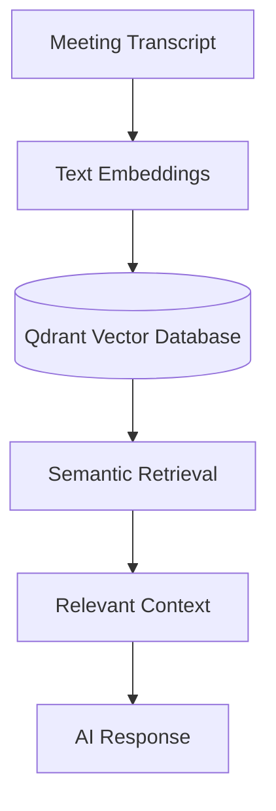
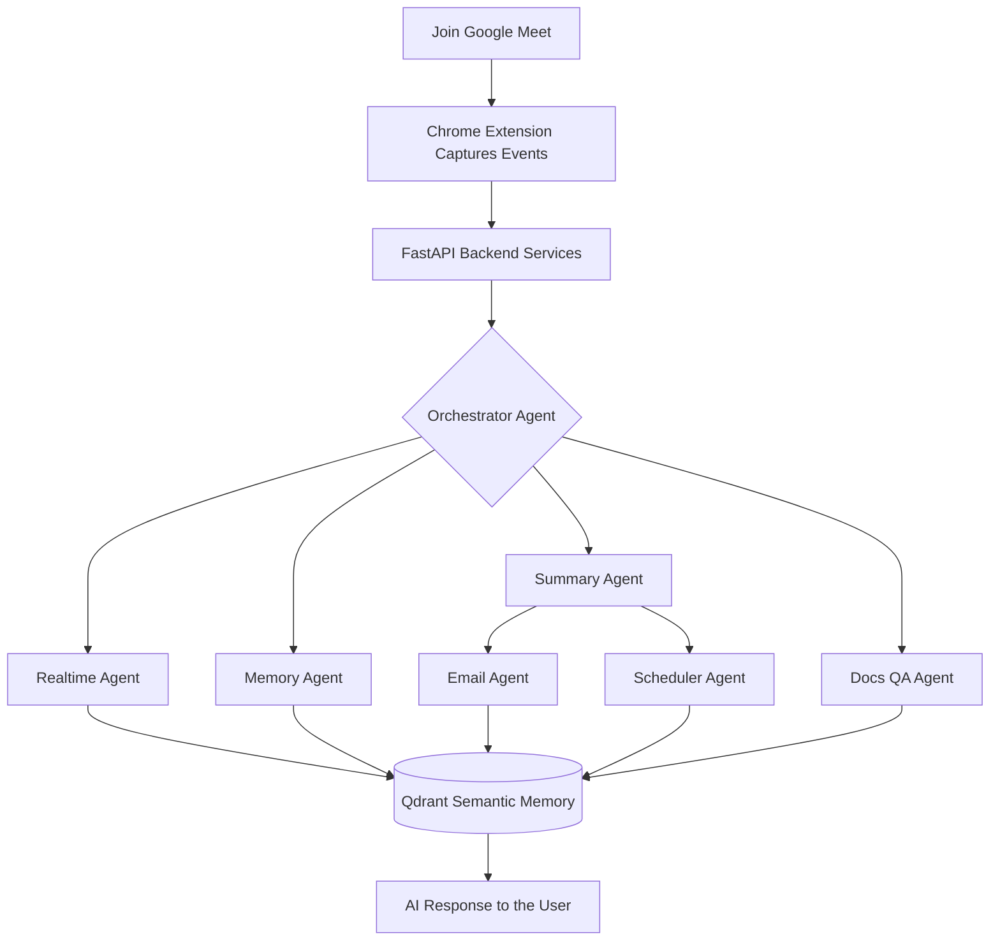

<div align="center">
  
  <h1>
    MeetMaxxing
  </h1>
  <h3>A Production-Inspired Multi-Agent AI Meeting Copilot</h3>

  <p>
    Transforming online meetings into intelligent, collaborative experiences through modular AI agents, semantic memory, and real-time assistance.
    <br />
    <br />
    <strong>
    Powered by Google ADK, Lyzr, Agent-to-Agent (A2A) Communication & Qdrant.
    </strong>
  </p>
</div>

---

<div align="center">
Built with modern AI engineering practices to provide a scalable, modular, and collaborative meeting experience.
</div>

---

<div align="center">


</div>

<br />

# 🚀 Project Vision

Modern meetings generate valuable discussions, decisions, and action items—but much of that information is quickly forgotten or scattered across notes, emails, and calendars.

**MeetMaxxing** reimagines meeting intelligence through a **multi-agent architecture**, where specialized AI agents collaborate instead of relying on a single monolithic AI workflow.

Built around **Google ADK**, **Lyzr**, **Agent-to-Agent (A2A) communication**, and **Qdrant semantic memory**, MeetMaxxing demonstrates how modern AI systems can coordinate, remember context, automate follow-ups, and assist users throughout an online meeting.

Rather than being just another meeting summarizer, MeetMaxxing showcases how multiple AI agents can work together to provide a scalable, modular, and production-inspired meeting experience.

## 🎯 Key Objectives
- **Multi-Agent Intelligence**: Specialized AI agents collaborate to perform dedicated tasks instead of relying on a single monolithic LLM.
- **Real-Time Assistance**: Receive contextual suggestions, meeting insights, and intelligent support while the meeting is in progress.
- **Persistent Semantic Memory**: Store and retrieve meeting knowledge using vector embeddings powered by Qdrant.

---

# 🧠 Why MeetMaxxing?

Unlike conventional AI meeting assistants that rely on a single large language model prompt, MeetMaxxing adopts a **collaborative multi-agent design**.

Each AI agent focuses on a specialized responsibility—from live assistance and meeting summarization to semantic memory retrieval, email drafting, scheduling, and document-based question answering.

This modular architecture makes the system more scalable, maintainable, and capable of handling complex workflows while demonstrating modern AI engineering principles using:

- **Google ADK** for specialized AI agents
- **A2A Communication** for seamless agent collaboration
- **Qdrant** for persistent semantic memory
- **Lyzr** for intelligent workflow orchestration

---

# ✨ Core Features

MeetMaxxing transforms traditional online meetings into intelligent, AI-assisted collaborative experiences through a modular multi-agent architecture.

### 🤖 Multi-Agent Intelligence
Specialized AI agents collaborate to perform dedicated tasks instead of relying on a single monolithic LLM.

### ⚡ Real-Time Assistance
Receive contextual suggestions, meeting insights, and intelligent support while the meeting is still in progress.

### 🧠 Semantic Memory
Store and retrieve meeting knowledge using vector embeddings powered by Qdrant for context-aware conversations.

### 📝 Smart Meeting Summaries
Automatically generate concise summaries, key discussion points, and actionable takeaways after every meeting.

### ✉️ AI Follow-ups
Generate professional follow-up emails containing meeting highlights and action items.

### 📅 Intelligent Scheduling
Create reminders and follow-up meetings directly from extracted action items.

### 📄 Document Question Answering
Upload supporting documents and allow AI agents to answer questions using meeting context.

### ⏱️ Late Join Recaps
Users joining late receive an instant AI-generated summary of everything discussed so far.

---

# 🌐 AI Agent Ecosystem

MeetMaxxing follows a **collaborative multi-agent architecture** where each agent has a clearly defined responsibility. Instead of overloading a single model with every task, specialized agents work together to deliver a smarter and more scalable meeting experience.

| Agent | Responsibility |
| :--- | :--- |
| **Transcription Agent** | Processes meeting transcripts and streams conversation data to the system. |
| **Realtime Agent** | Generates contextual suggestions and live assistance during meetings. |
| **Summary Agent** | Produces concise meeting summaries, key points, and action items. |
| **Memory Agent** | Stores semantic embeddings inside Qdrant and retrieves historical meeting knowledge. |
| **Email Agent** | Drafts follow-up emails using meeting context. |
| **Scheduler Agent** | Converts action items into calendar events and reminders. |
| **Docs QA Agent** | Answers user questions using uploaded documents combined with meeting context. |
| **Late Join Agent** | Instantly summarizes previous discussion for participants joining mid-meeting. |
| **Orchestrator Agent** | Coordinates communication between agents and routes tasks intelligently. |

---

# ⚡ Google ADK in Action

Google ADK forms the backbone of MeetMaxxing's intelligent agent ecosystem.

Rather than building one large AI workflow, MeetMaxxing uses Google ADK to create **specialized agents**, each equipped with its own reasoning capabilities and dedicated tools.

This modular design enables:
- Independent task execution
- Tool-specific reasoning
- Better scalability
- Easier maintenance
- Collaborative decision making between AI agents

Every major meeting capability—from summarization and semantic retrieval to scheduling and follow-up generation—is powered by dedicated Google ADK agents working together.

---

# 🤝 Agent-to-Agent (A2A) Communication

One of the core objectives of MeetMaxxing is to demonstrate effective **Agent-to-Agent (A2A) communication**.

Instead of executing tasks sequentially within a single workflow, specialized agents exchange context and collaborate to solve complex meeting scenarios.

<p align="center">
  
</p>

This architecture allows:
- Parallel execution of specialized tasks
- Better separation of responsibilities
- Easier extensibility for future agents
- Efficient information sharing between agents
- Production-inspired AI orchestration

---

# 🧠 Persistent Memory with Qdrant

MeetMaxxing doesn't forget previous meetings.

Instead, meeting conversations are transformed into **vector embeddings** and stored inside **Qdrant**, enabling semantic search across historical discussions.



This enables users to ask contextual questions like:
> *"What decisions were made regarding our authentication module last week?"*

Instead of keyword matching, Qdrant retrieves semantically similar discussions, allowing AI agents to respond with meaningful context.

---

# ⚙️ Lyzr-Powered Workflow Orchestration

Lyzr strengthens MeetMaxxing's orchestration layer by coordinating complex AI workflows across multiple specialized agents.

It enables:
- Intelligent workflow management
- Agent coordination
- Dynamic task routing
- Context propagation
- Scalable AI execution

Combined with Google ADK and A2A communication, Lyzr helps transform independent AI agents into a cohesive collaborative system.

---

# Application Showcase

## Chrome Extension

<p align="center">


</p>

The Chrome Extension serves as the primary user interface, enabling real-time interaction with AI agents directly within Google Meet.

---

## Live AI Assistance

<p align="center">

</p>

Receive contextual suggestions, insights, and assistance while the meeting is still ongoing.

---

## Meeting Summary

<p align="center">

</p>

Automatically generate concise summaries, discussion highlights, and actionable takeaways.

---

## Semantic Memory

<p align="center">

</p>

Retrieve information from previous meetings using semantic similarity instead of keyword matching.

---

## AI Follow-up Emails

<p align="center">

</p>

Generate polished follow-up emails with meeting highlights and assigned action items.

---

## Smart Scheduling

<p align="center">
  
</p>

Convert action items into reminders and calendar events with minimal user effort.

---

## Dashboard

<p align="center">

</p>

Access previous meetings, semantic memory, analytics, and meeting history from a centralized dashboard.

---

# 🏗️ Why This Architecture?

Traditional AI meeting assistants often rely on a **single prompt** to perform transcription, summarization, memory retrieval, scheduling, and follow-up generation.

MeetMaxxing takes a different approach. Instead of asking one model to do everything, responsibilities are distributed across specialized agents that collaborate through A2A communication.

This architecture offers several advantages:
- ✅ Modular and maintainable
- ✅ Easier to extend with new agents
- ✅ Better scalability
- ✅ Clear separation of responsibilities
- ✅ Persistent semantic memory
- ✅ Production-inspired system design

The result is an AI meeting copilot that doesn't simply answer questions—it coordinates multiple intelligent agents to understand, remember, and act on meeting information in real time.

---

# 🔄 End-to-End Workflow

Every interaction inside MeetMaxxing follows an intelligent event-driven workflow.



---

# 🛠️ Technology Stack

| Layer | Technology | Purpose |
| :--- | :--- | :--- |
| **AI Framework** | Google ADK, Lyzr | Core agent logic and orchestration |
| **Communication** | A2A, gRPC | Inter-agent messaging and RPC |
| **Memory** | Qdrant | Vector embeddings and semantic search |
| **Backend** | FastAPI, Python | High-performance API services |
| **Frontend** | Next.js, TypeScript | Dashboard and user interface |
| **Client** | Chrome Extension | Google Meet integration |
| **Database** | Supabase | Relational data and auth |
| **Cache** | Redis | State management and caching |
| **Observability** | Langfuse, OpenTelemetry, Jaeger | Monitoring and tracing |

---

# 📁 Repository Structure

The codebase is organized into modular services to enforce separation of concerns:

```bash
MeetMaxxing/
│
├── backend/                       # Python FastAPI Backend
│   ├── main.py                    # Entry point for backend services
│   │
│   ├── agents/                    # AI Agents logic (Google ADK)
│   │   ├── docs_qa_agent.py       
│   │   ├── email_agent.py         
│   │   ├── orchestrator.py        # Central agent router
│   │   └── summary_agent.py       
│   │
│   ├── api/                       # REST API routes
│   │   ├── routes_calendar.py     
│   │   ├── routes_meeting.py      
│   │   └── routes_memory.py       
│   │
│   ├── core/                      # Core configuration and integrations
│   │   ├── lyzr_integration.py    
│   │   └── redis_client.py        
│   │
│   ├── grpc_bus/                  # gRPC communication layer (A2A)
│   │   └── grpc_server.py         
│   │
│   ├── memory/                    # Vector memory logic (Qdrant)
│   │   └── qdrant_client.py       
│   │
│   └── services/                  # Third-party integrations
│       ├── calendar_service.py    
│       └── gmail_service.py       
│
├── extension/                     # Chrome Extension
│   ├── background.js              # Service worker
│   ├── content.js                 # Content script injected into Meet
│   ├── manifest.json              # Extension manifest
│   │
│   └── sidebar-app/               # React Sidebar App UI (Vite)
│       └── src/
│           ├── App.tsx            # Main sidebar view
│           └── components/        # Sidebar UI Components
│               ├── Agents.tsx     
│               └── ContextAgent.tsx
│
├── frontend/                      # Next.js Web Dashboard
│   └── src/
│       ├── app/                   # Next.js App Router
│       │   ├── layout.tsx         # Root Layout Wrapper
│       │   ├── page.tsx           # Dashboard Home
│       │   ├── meetings/          # Meeting Details Route
│       │   └── memory/            # Semantic Search Route
│       │
│       ├── components/            # UI Components
│       │   ├── ContextCard.tsx    
│       │   ├── MeetingCard.tsx    
│       │   └── skeletons/         # Loading States
│       │
│       └── lib/                   # API clients and utilities
│           └── supabase.ts        
│
├── supabase/                      # Database migrations and configuration
└── qdrant_data/                   # Vector store persistent data (ignored in git)
```

---

## 🚀 Getting Started

### Prerequisites
- **Node.js**: v18 or higher
- **Python**: v3.10+
- **Docker**: For running Qdrant, Redis, etc.

### Installation

1. **Clone the repository**
   ```bash
   git clone https://github.com/darshan-gowdaa/MeetMaxxing.git
   cd MeetMaxxing
   ```

2. **Install All Dependencies**
   (This will automatically install frontend packages and setup the backend using `uv`)
   ```bash
   npm install
   ```

3. **Start All Services**
   From the root directory, you can start all servers (with friendly error messages):
   ```bash
   npm start
   ```

### Load Chrome Extension

1. Open Chrome
2. Go to `chrome://extensions`
3. Enable **Developer Mode**
4. Click **Load unpacked**
5. Select the `extension` folder.

---

# 🗺️ Roadmap

- [ ] Smarter AI meeting coaching
- [ ] Voice interaction
- [ ] Multi-language support
- [ ] Mobile companion app
- [ ] Slack & Microsoft Teams integration
- [ ] Custom enterprise knowledge base
- [ ] Fine-grained user personalization
- [ ] Multi-meeting analytics dashboard

---

# 👥 Meet the Team

<div align="center">
<table>
<tr>
<td align="center" width="33%">
<a href="https://github.com/darshan-gowdaa"><b>@darshan-gowdaa</b></a><br>
Darshan Gowda
</td>
<td align="center" width="33%">
<a href="https://github.com/kanikapitaliya"><b>@kanikapitaliya</b></a><br>
Kanika Pitaliya
</td>
<td align="center" width="33%">
<a href="https://github.com/yar123yar"><b>@yar123yar</b></a><br>
Yarthem Muivah
</td>
</tr>
</table>
</div>

---

# 🌟 Support

If you found MeetMaxxing interesting, consider giving the repository a ⭐.
It helps others discover the project and motivates us to continue improving it.

---

<div align="center">
Built using <strong>Google ADK</strong>, <strong>Lyzr</strong>, <strong>A2A</strong>, <strong>Qdrant</strong>, and modern AI engineering practices.
</div>
