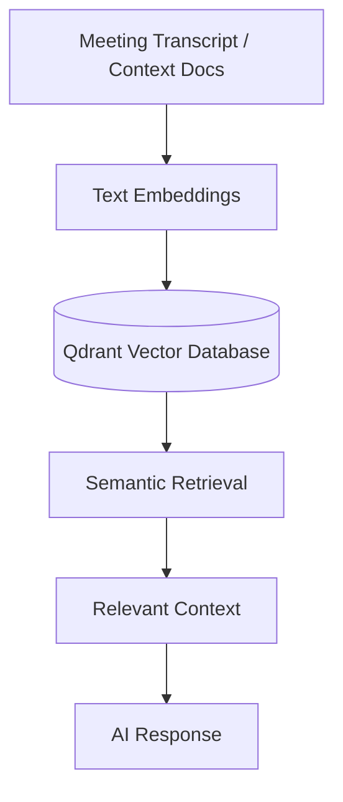
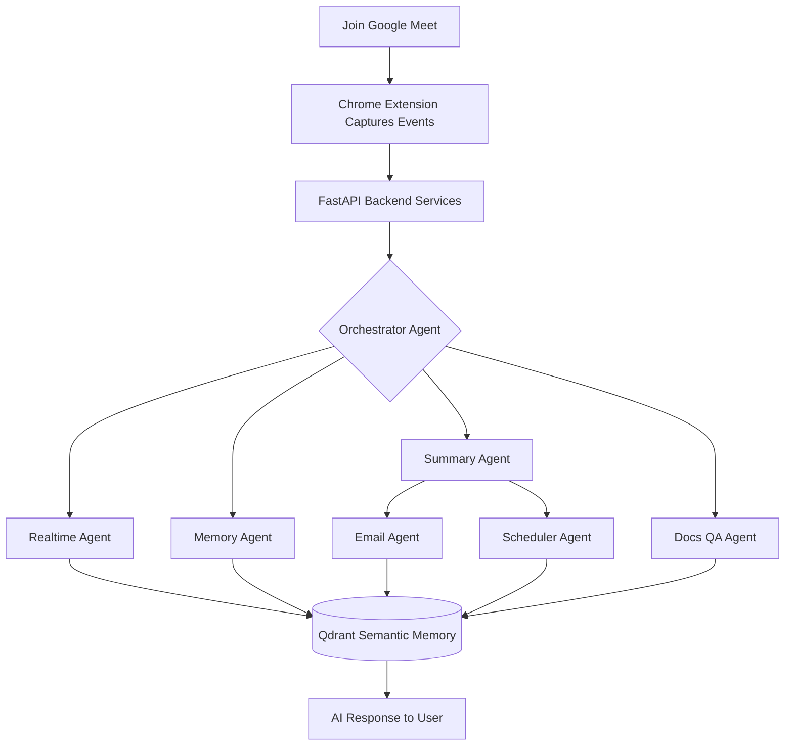

<div align="center">
  
  <h1>🚀 MeetMaxxing</h1>
  <h3>A Production-Inspired Multi-Agent AI Meeting Copilot</h3>
  <p>
    Transforming online meetings into intelligent, collaborative experiences through modular AI agents, semantic memory, and real-time assistance.
  </p>
  <p>
    <b>Powered by Google ADK, Lyzr, Agent-to-Agent (A2A) Communication & Qdrant.</b>
  </p>
  
  <div>
    
    
    
    
    
    
    
    
    
    
    
  </div>
</div>

<br />

## 🌟 Project Vision

Modern meetings generate valuable discussions, decisions, and action items—but much of that information is quickly forgotten or scattered across notes, emails, and calendars.

**MeetMaxxing** reimagines meeting intelligence through a **multi-agent architecture**, where specialized AI agents collaborate instead of relying on a single monolithic AI workflow.

Built around **Google ADK**, **Lyzr**, **Agent-to-Agent (A2A) communication**, and **Qdrant semantic memory**, MeetMaxxing demonstrates how modern AI systems can coordinate, remember context, automate follow-ups, and assist users throughout an online meeting.

Rather than being just another meeting summarizer, MeetMaxxing showcases how multiple AI agents can work together to provide a scalable, modular, and production-inspired meeting experience.

### 🎯 Key Objectives
- **Multi-Agent Intelligence**: Specialized AI agents collaborate to perform dedicated tasks instead of relying on a single monolithic LLM.
- **Real-Time Assistance**: Receive contextual suggestions, meeting insights, and intelligent support while the meeting is in progress.
- **Persistent Semantic Memory**: Store and retrieve meeting knowledge using vector embeddings powered by Qdrant.

---

## 🎨 Android Native Material 3 Expressive Frontend

Our frontend is completely inspired by **Android Native Material 3 Expressive Design**, ensuring a premium, fluid, and intuitive user experience. 

- **Custom CSS Implementation**: We meticulously crafted our own styling using custom CSS (`globals.css`, `index.css`, `sidepanel.css`) and a Python-powered theming script (`apply_colors.py`) to generate authentic Material 3 color palettes instead of relying on heavy pre-built UI libraries.
- **Micro-Animations**: Features custom `Md3Loading` animations and interactive elements that respond to user intent with satisfying, native-like feedback.
- **Selectable Grid Experience**: Mimicking the elegant selection experience of Google Photos, our custom Selectable Grid component allows users to seamlessly select multiple meetings and contexts with smooth transitions, persistent state, and batch actions.

---

## 🧠 Powerful Context Management (RAG)

MeetMaxxing includes an advanced **Context Manager** designed to feed external knowledge to our AI agents:

- **Seamless Document Uploads**: Users can upload PDF, DOCX, and TXT files directly to the dashboard.
- **Qdrant Vector Indexing**: Documents are instantly processed, chunked, and stored as vector embeddings in Qdrant.
- **Interactive Context Chat**: Users can chat directly with the Context Agent to ask questions specifically about the uploaded documents, augmenting meeting insights with external business knowledge.

---

## ✨ Core Features (Every Detail Covered)

MeetMaxxing transforms traditional online meetings into intelligent, AI-assisted collaborative experiences through a modular multi-agent architecture.

| 🚀 Feature | 💡 Description |
| :--- | :--- |
| **🤖 Multi-Agent Intelligence** | Specialized AI agents collaborate to perform dedicated tasks instead of relying on a single monolithic LLM. Includes Orchestrator, Transcriber, Realtime, Summary, Memory, Email, Scheduler, Docs QA, and Late Join agents. |
| **⚡ Real-Time Assistance & Transcript Viewing** | Receive contextual suggestions, meeting insights, and intelligent support while the meeting is still in progress. View the real-time scrolling meeting transcript beautifully rendered. |
| **🧠 Semantic Memory & Knowledge Retrieval** | Store and retrieve meeting knowledge using vector embeddings powered by Qdrant for context-aware conversations. |
| **📝 Smart Meeting Summaries & Decisions Tracking** | Automatically generate concise summaries, key discussion points, and actively track formal decisions made during the call. |
| **✅ Action Items Tracking** | Automatically extract and list actionable items with assignees and due dates, manageable right from the dashboard. |
| **✉️ AI Follow-ups** | Generate professional follow-up emails containing meeting highlights and action items. |
| **📅 Intelligent Scheduling** | Create reminders and follow-up meetings directly from extracted action items. |
| **📄 Document Question Answering (RAG)** | Upload supporting documents and allow AI agents to answer questions using meeting context via our Context Manager. |
| **⏱️ Late Join Recaps** | Users joining late receive an instant AI-generated summary of everything discussed so far. |
| **🛠️ Granular Management Controls** | Includes built-in Edit and Delete Dialogs, Selectable Grid batch operations, and file uploading dialogs for total user control over their data. |

---

## 🌐 AI Agent Ecosystem

MeetMaxxing follows a **collaborative multi-agent architecture** where each agent has a clearly defined responsibility. Instead of overloading a single model with every task, specialized agents work together to deliver a smarter and more scalable meeting experience.

| Agent | Responsibility |
| :--- | :--- |
| **Transcription Agent** 🎙️ | Processes meeting transcripts and streams conversation data to the system. |
| **Realtime Agent** ⚡ | Generates contextual suggestions and live assistance during meetings. |
| **Summary Agent** 📝 | Produces concise meeting summaries, decisions, and action items. |
| **Memory Agent** 🧠 | Stores semantic embeddings inside Qdrant and retrieves historical meeting knowledge. |
| **Email Agent** ✉️ | Drafts follow-up emails using meeting context. |
| **Scheduler Agent** 📅 | Converts action items into calendar events and reminders. |
| **Docs QA Agent** 📄 | Answers user questions using uploaded documents combined with meeting context. |
| **Late Join Agent** ⏱️ | Instantly summarizes previous discussion for participants joining mid-meeting. |
| **Orchestrator Agent** 🎭 | Coordinates communication between agents and routes tasks intelligently. |

---

## ⚡ Google ADK in Action

Google ADK forms the backbone of MeetMaxxing's intelligent agent ecosystem.

Rather than building one large AI workflow, MeetMaxxing uses Google ADK to create **specialized agents**, each equipped with its own reasoning capabilities and dedicated tools.

This modular design enables:
- Independent task execution
- Tool-specific reasoning
- Better scalability
- Easier maintenance
- Collaborative decision making between AI agents

---

## 🤝 Agent-to-Agent (A2A) Communication

One of the core objectives of MeetMaxxing is to demonstrate effective **Agent-to-Agent (A2A) communication**.

Instead of executing tasks sequentially within a single workflow, specialized agents exchange context and collaborate to solve complex meeting scenarios.

<p align="center">
  
</p>

---

## 🧠 Persistent Memory with Qdrant

MeetMaxxing doesn't forget previous meetings.

Instead, meeting conversations are transformed into **vector embeddings** and stored inside **Qdrant**, enabling semantic search across historical discussions.



---

## ⚙️ Lyzr-Powered Workflow Orchestration

Lyzr strengthens MeetMaxxing's orchestration layer by coordinating complex AI workflows across multiple specialized agents.

---

## 🎨 Application Showcase

*(Replace placeholders below with actual GIFs/Screenshots before publishing for a premium presentation)*

| Feature | Preview |
| :--- | :--- |
| **Material 3 Dashboard & Hero**<br><br>Access previous meetings, semantic memory, analytics, and meeting history from a centralized dashboard featuring fluid MD3 Expressive design, smooth loading animations (`Md3Loading`), and a personalized Hero section (`DashboardHero`). | <br><br>👉 *[GIF PLACEHOLDER: Show fluid MD3 animations and personalized greeting/stats on Dashboard]* |
| **Context Library & Knowledge Base**<br><br>Manage all your external knowledge. Upload PDF, DOCX, and TXT files, view content in raw chunks via `ViewContentDialog`, and organize documents. | 👉 *[SCREENSHOT PLACEHOLDER: Show Context Library page with ContextCards]* |
| **Interactive Context Chat (RAG)**<br><br>Query documents via the RAG-enabled Context Manager. Instantly retrieve business knowledge alongside meeting notes. | 👉 *[GIF PLACEHOLDER: Show uploading and chatting in Context Manager]* |
| **Selectable Grid Experience**<br><br>Mimicking Google Photos, seamlessly select multiple meetings and contexts with smooth transitions, persistent state, and batch actions (Edit/Delete). | 👉 *[GIF PLACEHOLDER: Show Selectable Grid in action with multi-select and batch delete]* |
| **Chrome Extension Integration**<br><br>The Chrome Extension serves as the primary user interface, enabling real-time interaction with AI agents directly within Google Meet. | <br><br>👉 *[GIF PLACEHOLDER: Show extension opening, authenticating, and connecting to a live Google Meet]* |
| **Live AI Assistance & Real-time Transcript**<br><br>Receive contextual suggestions, insights, and assistance while the meeting is still ongoing. Real-time scrolling meeting transcript beautifully rendered. | <br><br>👉 *[GIF PLACEHOLDER: Show real-time transcript streaming and live agent popup suggestions]* |
| **Smart Meeting Summaries & Decisions**<br><br>Automatically generate concise summaries, key discussion points, and actively track formal decisions made during the call in isolated tabs. | <br><br>👉 *[SCREENSHOT PLACEHOLDER: High-res shot showing meeting summary page and decisions tab]* |
| **Semantic Memory Search**<br><br>Retrieve information from previous meetings using semantic similarity instead of keyword matching across your entire workspace. | <br><br>👉 *[GIF PLACEHOLDER: Show semantic search query returning historical context]* |
| **Action Items & Smart Scheduling**<br><br>Automatically extract actionable items with assignees and due dates. Convert action items into reminders and calendar events with minimal user effort. | <br><br>👉 *[GIF PLACEHOLDER: Show converting an action item to a calendar event directly from dashboard]* |
| **AI Follow-up Emails**<br><br>Generate polished follow-up emails with meeting highlights and assigned action items. | <br><br>👉 *[SCREENSHOT PLACEHOLDER: High-res shot of generated follow-up email ready to send]* |

---

## 🏗️ Why This Architecture?

Traditional AI meeting assistants often rely on a **single prompt** to perform transcription, summarization, memory retrieval, scheduling, and follow-up generation.

MeetMaxxing takes a different approach. Instead of asking one model to do everything, responsibilities are distributed across specialized agents that collaborate through A2A communication.

---

## 🔄 End-to-End Workflow

Every interaction inside MeetMaxxing follows an intelligent event-driven workflow.



---

## 🛠️ Technology Stack

| Layer | Technology | Purpose |
| :--- | :--- | :--- |
| **AI Framework** 🤖 |    | Core agent logic and orchestration |
| **Communication** 📡 |    | Inter-agent messaging and RPC |
| **Memory / RAG** 🧠 |  | Vector embeddings, doc ingestion, semantic search |
| **Backend** ⚙️ |    | High-performance API services |
| **Frontend UI** 🖥️ |     | Dashboard with Google Photos-like select grid |
| **Client** 🔌 |    | Google Meet integration |
| **Database** 🗄️ |  | Relational data and auth |
| **Cache** ⚡ |  | State management and caching |
| **Observability** 🔍 |    | Monitoring and tracing |

---

## 📁 Repository Structure

```bash
MeetMaxxing/
│
├── backend/                       # Python FastAPI Backend
│   ├── main.py                    # Entry point for backend services
│   ├── agents/                    # AI Agents logic (Google ADK)
│   ├── api/                       # REST API routes
│   ├── core/                      # Core configuration and integrations
│   ├── grpc_bus/                  # gRPC communication layer (A2A)
│   ├── memory/                    # Vector memory logic (Qdrant)
│   └── services/                  # Third-party integrations
│
├── extension/                     # Chrome Extension (Vite + React)
│   ├── background.js              # Service worker
│   ├── content.js                 # Content script injected into Meet
│   └── sidebar-app/               # React Sidebar App UI (Vite)
│
├── frontend/                      # Next.js Web Dashboard (Material 3 Expressive)
│   └── src/
│       ├── app/                   # Next.js App Router
│       ├── components/            # Custom MD3 UI Components (SelectableGrid, ContextManager)
│       ├── scripts/               # apply_colors.py for MD3 dynamic theming
│       └── lib/                   # API clients and utilities
│
├── supabase/                      # Database migrations and configuration
└── qdrant_data/                   # Vector store persistent data
```

---

## 🚀 Getting Started

### Prerequisites
-  **v18 or higher**
-  **v3.10+**
-  **For running Qdrant, Redis, etc.**

### Installation

1. **Clone the repository**
   ```bash
   git clone https://github.com/darshan-gowdaa/MeetMaxxing.git
   cd MeetMaxxing
   ```

2. **Install All Dependencies**
   *(This will automatically install frontend packages and setup the backend using `uv`)*
   ```bash
   npm install
   ```

3. **Start All Services**
   *From the root directory, you can start all servers (with friendly error messages):*
   ```bash
   npm start
   ```

### Load Chrome Extension

1. Open Chrome
2. Go to `chrome://extensions`
3. Enable **Developer Mode**
4. Click **Load unpacked**
5. Select the `extension` folder.

---

## 🗺️ Roadmap

| Status | Milestone / Feature |
| :---: | :--- |
| 🚧 | Smarter AI meeting coaching 🧠 |
| 🚧 | Voice interaction 🎙️ |
| 🚧 | Multi-language support 🌍 |
| 🚧 | Mobile companion app 📱 |
| 🚧 | Slack & Microsoft Teams integration 💬 |
| 🚧 | Custom enterprise knowledge base 🏢 |
| 🚧 | Fine-grained user personalization 👤 |
| 🚧 | Multi-meeting analytics dashboard 📊 |

---

## 👥 Meet the Team

<div align="center">
<table>
<tr>
<td align="center" width="33%">
<a href="https://github.com/darshan-gowdaa"></a><br>
<a href="https://github.com/darshan-gowdaa"><b>Darshan Gowda</b></a>
</td>
<td align="center" width="33%">
<a href="https://github.com/kanikapitaliya"></a><br>
<a href="https://github.com/kanikapitaliya"><b>Kanika Pitaliya</b></a>
</td>
<td align="center" width="33%">
<a href="https://github.com/yar123yar"></a><br>
<a href="https://github.com/yar123yar"><b>Yarthem Muivah</b></a>
</td>
</tr>
</table>

### All Contributors
<a href="https://github.com/darshan-gowdaa/MeetMaxxing/graphs/contributors">
  
</a>
</div>

---

## 🌟 Support

If you found MeetMaxxing interesting, consider giving the repository a ⭐.
It helps others discover the project and motivates us to continue improving it.

---

<div align="center">
Built using <strong>Google ADK</strong>, <strong>Lyzr</strong>, <strong>A2A</strong>, <strong>Qdrant</strong>, and modern AI engineering practices.
</div>
